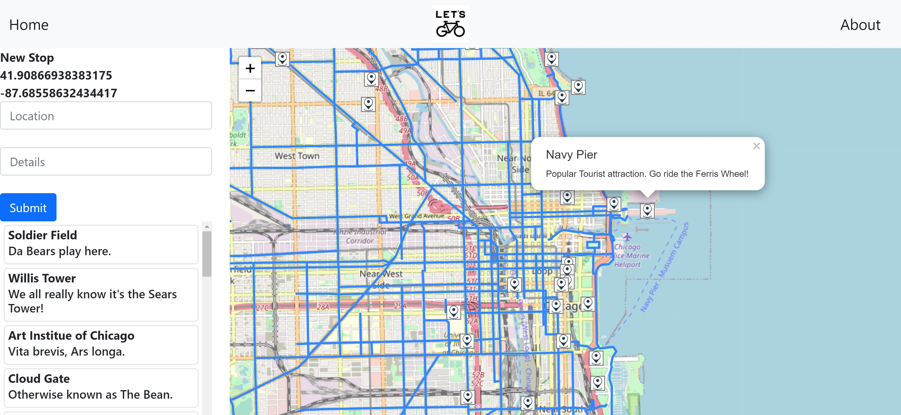

# Let's Go

AS A 
cyclist

I WANT
to find a bike path with notable destinations on the way

SO THAT 
I can have an awesome bike ride and find cool things on my path

[Link to Website](https://glacial-waters-54685.herokuapp.com/)

## Table of Content
* [Description](#Description)

* [Installation](#Installation)

* [Question](#Question)

## Description
Our application is one of the first of its kind; using GeoJSON, react-leaflet npm and bike path data for the city of Chicago. The application will allow any average joe to be able to explore whichever city they’re in on a bike, and find points of interest and rest stops along the way.  Whether it be a tourist going for a summer bike ride, a commuter who wants to switch up their route home, or a cyclist who wants to change their training route. It allows riders to see and experience new things such as landmarks, art, restaurants/cafes, and little gems of the city/town.
   

## Installation:
After download the project, run `npm install` in terminal. Do not forget to run it at the same directory which your downloaded folder is. to run the app, in terminal type `npm run seed` and then `npm start`. Also it needs to run mongod in a separate terminal!

## Question?
If you have any question or require any further information, feel free to contact us. 

GitHub: 
* https://github.com/pnguyen6910
* https://github.com/karimi65
* https://github.com/ryanpburnett

        

Email: 
* pnguyen6910@gmail.com
* ali216k@gmail.com
* ryanpburnett@yahoo.com
